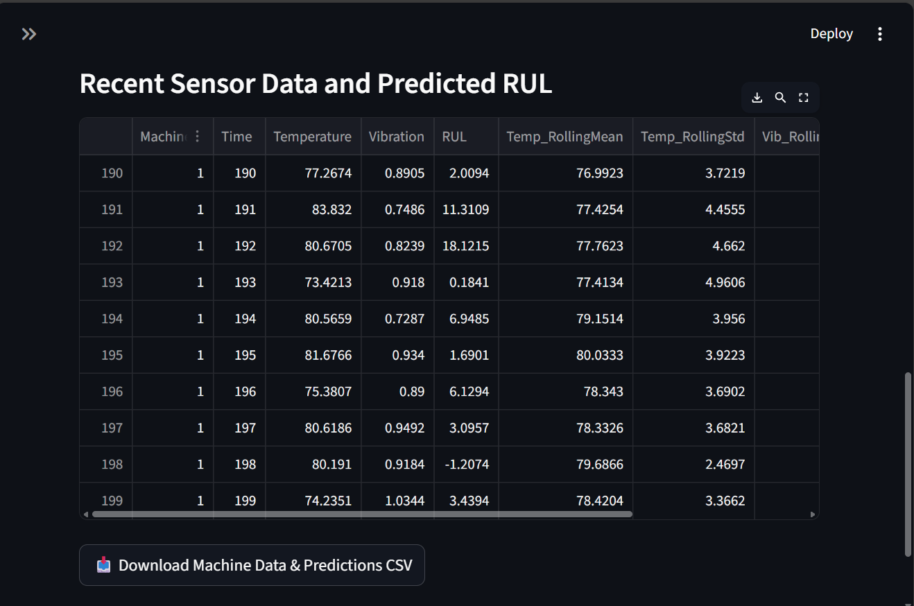
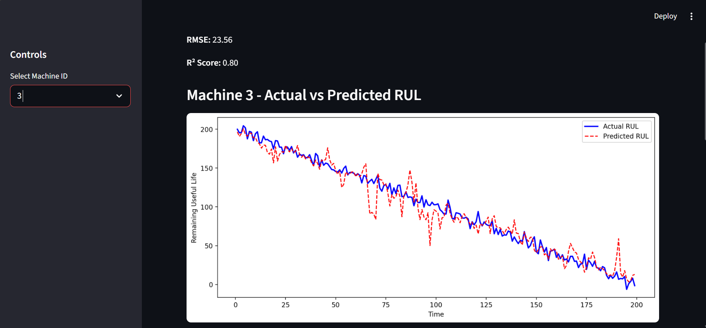

# Predictive Maintenance - RUL Prediction

## Overview
Simulates machine sensor data and predicts **Remaining Useful Life (RUL)** using a **Random Forest Regressor**.  
Interactive **Streamlit dashboard** allows selecting machines, viewing actual vs predicted RUL, feature importance, and downloading predictions.

## Tools
- Python, Pandas, NumPy
- Scikit-learn (Random Forest)
- Matplotlib (visualization)
- Streamlit (dashboard)

## Features
- Predict Remaining Useful Life (RUL)
- Visualize actual vs predicted RUL
- Feature importance chart
- Table of recent sensor readings and predictions
- Download CSV of predictions

---

## Screenshots

## Screenshots

### Actual vs Predicted RUL


### Feature Importance


### Demo GIF


---

## How to Run

1. Clone the repo:

```bash
git clone https://github.com/mellenatwine.png/predictive-maintenance.git
cd predictive-maintenance


